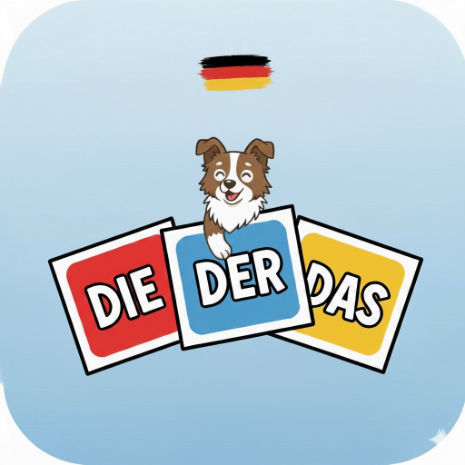

# Awesome Der Die Das - Reinventing learning

<p align="center">
  
</p>

A modern Android flashcard app designed to help learners master German grammatical articles (der, die, das) through interactive gameplay and gamification.

## 🌟 Features

### Core Gameplay
- **Flashcard Learning**: Learn German nouns with their correct articles
- **Interactive Quiz**: Choose between DER, DIE, or DAS for each noun
- **Real-time Feedback**: Immediate visual and text feedback for correct/incorrect answers in your selected language
- **Smooth Animations**: Card slide-in transitions and color-coded responses
- **Overflow Protection**: Long German compound words automatically handled with ellipsis

### Gamification
- **Session-based Games**: Choose from 5, 10, 25, or 50 cards per session
- **Live Statistics**: Track correct/wrong answers and accuracy in real-time
- **Timer**: Live timer with pause/resume on app focus changes
- **Performance Metrics**: Cards per minute tracking
- **Game History**: Complete history of all past game sessions with detailed stats

### Internationalization (i18n)
- **Multi-language Support**: English and Portuguese (easily extensible)
- **System Locale Detection**: Automatically detects and sets language on first launch
- **Full Translation**: All UI elements translated
- **CEFR Level Filtering**: Filter words by proficiency level (A1-C2)
  - Cumulative loading: A2 shows A1+A2 words, B1 shows A1+A2+B1, etc.

### Data & Persistence
- **1,086 German Nouns**: Comprehensive vocabulary database with at least 60 unique nouns per article (DER/DIE/DAS) for each CEFR level
- **Dual Translations**: Each noun includes English and Portuguese translations
- **Room Database**: Persistent game session storage
- **SharedPreferences**: User settings and preferences

### Additional Features
- **Settings Screen**: Configure language and CEFR level
- **Delete Functionality**: Remove individual sessions or clear all history
- **Exit Game Option**: Back button to exit game sessions without saving to history
- **Easter Egg**: Hidden romantic message (click the logo!)

## 🛠️ Technical Stack

- **Language**: Kotlin
- **UI Framework**: Jetpack Compose
- **Architecture**: MVVM (Model-View-ViewModel)
- **Navigation**: Navigation Compose
- **Database**: Room (SQLite)
- **Concurrency**: Kotlin Coroutines & Flow
- **Dependency Injection**: Manual (Factory pattern)

## 📱 Screenshots

[Coming soon]

## 🏗️ Project Structure

```
app/src/main/java/okano/dev/android/derdiedas/
├── data/
│   ├── database/          # Room database entities and DAOs
│   ├── model/             # Data models (GermanNoun, Language, CEFRLevel)
│   ├── preferences/       # SharedPreferences manager
│   └── repository/        # Data repositories
├── navigation/            # Navigation graph and routes
├── ui/
│   ├── cardselection/     # Card count selection screen
│   ├── components/        # Reusable UI components (NeonLogo)
│   ├── easteregg/         # Easter egg screen
│   ├── flashcard/         # Main game screen with ViewModel
│   ├── history/           # Game history screen
│   ├── home/              # Main menu screen
│   ├── resources/         # String resources for translations
│   ├── results/           # Game results screen
│   ├── settings/          # Settings screen
│   └── theme/             # App theme and colors
└── MainActivity.kt        # Main activity entry point
```

## 🚀 Getting Started

### Prerequisites
- Android Studio Hedgehog (2023.1.1) or newer
- JDK 17 or newer
- Android SDK (minimum API 24)

### Building the Project

1. Clone the repository:
```bash
git clone https://github.com/yourusername/DerDieDas.git
cd DerDieDas
```

2. Open the project in Android Studio

3. Sync Gradle files

4. Run on an emulator or physical device

### Running Tests

```bash
./gradlew testDebugUnitTest
```

### Building a Release

Releases are automated: pushing a tag like `v1.0.4` builds, signs and uploads the app to Google Play, and publishes a signed APK on GitHub Releases. See [docs/RELEASING.md](docs/RELEASING.md) for the one-time setup.

To build a signed bundle locally, copy `keystore.properties.example` to `keystore.properties` (gitignored), fill in your upload key details and run:
```bash
./gradlew bundleRelease -PappVersionName=1.0.4
```

## 🎯 How to Use

1. **Start a New Game**: Select the number of flashcards you want to practice
2. **Play**: For each German noun, select the correct article (DER, DIE, or DAS)
3. **Track Progress**: Watch your statistics update in real-time
4. **Exit Anytime**: Use the back button to exit without saving the session to history
5. **Review Results**: See your performance summary after completing a session
6. **Check History**: View all past game sessions with detailed statistics
7. **Adjust Settings**: Change language or CEFR level based on your proficiency

## 🌍 Adding New Languages

The app is designed for easy language expansion:

1. Add new language to `Language` enum in `data/model/Language.kt`
2. Add translations to `LocalNounRepository.kt` in the noun translation maps
3. Add UI translations to `StringResources.kt`

Example:
```kotlin
// In Language.kt
SPANISH("es", "Español")

// In noun translations
mapOf("en" to "table", "pt" to "mesa", "es" to "mesa")

// In StringResources.kt
fun newGame(language: Language) = when (language) {
    Language.ENGLISH -> "New Game"
    Language.PORTUGUESE -> "Novo Jogo"
    Language.SPANISH -> "Nuevo Juego"
}
```

## 📊 CEFR Levels

The app uses the Common European Framework of Reference (CEFR) for language proficiency:

- **A1**: Beginner - Basic words and phrases
- **A2**: Elementary - Everyday expressions
- **B1**: Intermediate - Common situations
- **B2**: Upper Intermediate - Complex topics
- **C1**: Advanced - Fluent and spontaneous
- **C2**: Proficient - Near-native level
- **All**: Practice all levels combined

## 🎨 Key Features Breakdown

### Timer System
- Counts up during gameplay (MM:SS format)
- Automatically pauses when app loses focus
- Resumes when app regains focus
- State preserved throughout lifecycle

### Navigation
- Single Activity architecture
- Type-safe navigation with Navigation Compose
- Smooth transitions with fade effects
- Proper back stack management

### Database Schema
```kotlin
GameSessionEntity(
    id: Long
    totalCards: Int
    correctAnswers: Int
    wrongAnswers: Int
    accuracyPercentage: Int
    durationMillis: Long
    cardsPerMinute: Float
    timestamp: Long
)
```

## 🤝 Contributing

Contributions are welcome! Feel free to:
- Report bugs
- Suggest new features
- Submit pull requests
- Add more German nouns
- Add new language translations

## 📝 License

[Add your license here]

## 👨‍💻 Author

**Okano**

## 🎉 Acknowledgments

- CEFR framework for language proficiency standards
- German language learning community
- Glória (for the inspiration! 💖)

---

**Note**: This app is designed for educational purposes to help learners master German grammatical articles through interactive practice.
